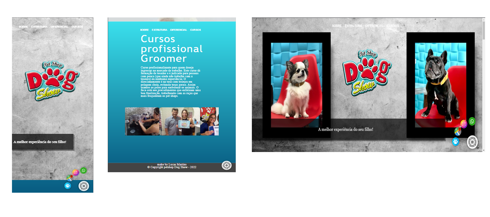

# Parallax 

# Sobre
<h2>Petshop Dogshow</h2>

    Homepage pensado para o usuário conseguir imediatamente ter, uma compreensão bastante clara de quem é a empresa e suas qualidades, além de levalos para redes sociais, localização e contatos para mais informações. Futuramente também, pensando para linkar com software com varias ferramentas.   
    

 
    Nesse projeto fiz ao estilo parallax, implementei um design limpo e agradavel visualmente, onde ficou super interativo, fácil e didático para o usuário utilizar.
    todas as imagens (fotos, ilustrações, backgrounds) fora produzidas por mim, com camera photoshop e ultilização de mesa digitalizadora Gaomon.

# Caracteristicas

- [x] Elemententos HTML semântico.
- [x] CSS , Responsivo Desktop, Tablet e Smartphone.  
- [x] navegação flutuante e interativa com JS.
- [x] animações.

# Autor
Made for Lucas Martins </> [see my linkedIn](www.linkedin.com/in/lucas-martins-desenvolvedor)
